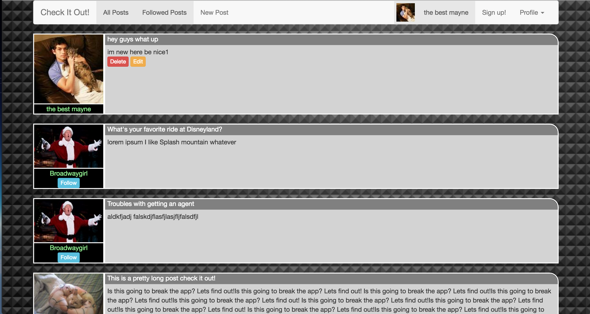

 
 

# Check It Out!
## (https://github.com/skempisty/check_it_out)
### Author: Stephen Kempisty

==========

##Introduction

Check It Out! is a message board app where you can post text and others 
can comment and reply to those posts and comments!

Development is ongoing, and many more features such as photo and video
uploading for posts and more are coming soon!
 
##Technologies

Check It Out! can be found on heroku and requires no installation to use.
 Technologies used in production include:
&nbsp;

- HTML
- CSS 
- Javascript
- jQuery
- Ruby
- Rails
- Heroku
- Bootstrap

##Design

The general design of Check It Out! is loosely based off of popular message board
and forum apps such as reddit and 4chan. The app's function is intended to be
general and accessible for a multitude of audiences. 

The order of completion for the app's features revolves around the concept
of a minimum viable product. Features were completed starting from the most
basic and necessary, growing in complexity as time permitted.    

##Get Started

No installation is required for Check It Out! Simply navigate to the following link sign up to begin using the app!

<a>https://quiet-lowlands-11979.herokuapp.com/</a>

If you would like to contribute to further development of Check It Out!, feel free to fork this repository. Permission to snoop around in the code is given whole-heartedly!

##Next Steps
There are many exciting features planned that unfortunately did not make it into the release version of Check It Out! Please check back for future versions. New features such as the following are coming soon!

- posts can include pictures and videos/video links
- timestamp for posts
- indicator for amount of comments on a post
- prioritization of popular posts to go to the top
- periodic deletion of old uncommented (in a long time) posts
 
